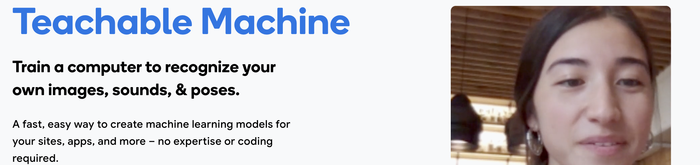

# Computer Vision RPS

Rock-Paper-Scissors is a game in which each player simultaneously shows one of three hand signals representing rock, paper, or scissors. Rock beats scissors. Scissors beats paper. Paper beats rock. The player who shows the first option that beats the other player's option wins. This is an implementation of an interactive Rock-Paper-Scissors game, in which the user can play with the computer using the camera. 

## Milestone 1 

- Creates a remote github repository for this project to version control the software.

- Connects the remote repository to a local clone using the command line.

```bash
git clone git clone https://github.com/d4min/computer-vision-rock-paper-scissors.git
```

## Milestone 2

- Created and trained a deep learning model using Teachable Machine to recognise images of users gesturing rock, paper, scissors or nothing through the webcam. 



## Milestone 3

- Used conda to create and install the dependencies required for the project.

- First created a new virtual environment with conda where the dependencies would be installed. 

```bash
conda create --name computer_vision python
```
It is important to use an environment seperate from base becasue virtual environments let you have a stable, reproducible, and portable environment. You are in control of which packages versions are installed and when they are upgraded. You can have as many environments as you want and this reduces the likelihood of dependencies between projects clashing and causing errors. 

```bash
conda install pip
conda install tensorflow opencv ipykernel
```
- I also exported the conda environment packages to a text file which is kept with the code to allow for other users to be able to install the required dependencies to work with the project.

```bash
conda list --explicit > requirements.txt
```

## Milestone 4

- Wrote the script manual_rps.py which is a manual version of the intended program which takes in a user choice through text and then picks the computer choice randomly from a list of choices. 

- Defined functions for taking the user choice as well as choosing the computer choice. 

```python
def get_computer_choice():
    rps  = ['Rock', 'Paper', 'Scissors']
    return random.choice(rps)
```
This uses the random library to pick a random item from the rps list and then returns the computer choice. 

```python
def get_user_choice():
    user_choice = input('Please enter rock, paper or scissors')
    return user_choice.capitalize()
```
Gets user input through a prompt, returns the input capitalised to ensure it is the right format for the rest of the script. 

- Used if else statements to determine the winner of the game by comparing the computer choice to the user choice. 

```python
def get_winner(computer_choice, user_choice):
    winner = ''
    if computer_choice == user_choice:
        print('It is a tie!')
        winner = 'Tie'
        ...
        ...
        ...
```
The above code shows a slice of the entire function which determines the winner. The function returns the winner of the game. 

- Defined a function which incorporates the logic of the game and allows the user to play the game. 

```python
def play():

    computer_choice = get_computer_choice()
    user_choice = get_user_choice()

    get_winner(computer_choice, user_choice)
```
The function runs the choice functions to obtain both the computers choice and the users choice, then calls the get_winner function with both as arguments.

## Milestone 5

- Combined both the manual_rps.py and RPS-Template.py scripts into one to allow the code to use the prediction returned from the deep learning model as the user input instead of the manual input. 

```python
def get_prediction():
    ...
    ...
    prediction = model.predict(data)
    ...
    rps = ["Rock", "Paper", "Scissors", "Nothing"]
    rps_prediction = 
    rps[prediction[0].tolist().index(max(prediction[0]))]
    ...
    ...
```
The prediction returned from the model is in the form of a nested numpy array which includes the predictions in float value of each possbile label. 

```python
prediction = [[0.8, 0.1, 0.04, 0.06]]

# The model predicts that the likelihood of the input being Rock is 80%, Paper is 10%, Scissors is 4% and Nothing is 6%
```
So in this example the most likely label is Rock. 

I used this numpy array to get the index of the max value from the inner list and got the corresponding value from the rps list. 

- Added a countdown where the model would be evaluating images from the webcam for three seconds and then would return the probabilities from the last image captured. I did this using the time() method from the time library in python.

```python
start_time = time.time()
 while (time.time() - start_time) < 3:
    ...
    ...
    ...
```
- Used recursion to rerun the program if the predicted value received from the model was nothing. This is because nothing is not a valid input to be used in the game. 

```python
if rps_prediction == "Nothing":
            print("You haven't picked an option please gesture Rock, Paper or Scissors")
            get_prediction(self)
        else:
            print(f"You have chosen {rps_prediction}!")
            return rps_prediction
```
- Added to the play() function to allow the game to run until one of the players got to 3 wins or until 5 rounds were played. 

```python
computer_wins = 0
user_wins =  0
rounds_played = 0
while computer_wins < 3 and user_wins < 3 and rounds_played < 5:
    ...
    ...
    ...
```
The rounds played is incremented with each round and the win counts are incremented depending on who wins. 

- Used good OOP practices to define the computer_vision_rps class so that we can have multiple game objects. Included the functions used to play the game as methods.

```python
class computer_vision_rps:

    def get_computer_choice(self):
        ...
    
    def get_prediction(self):
        ...

    def get_winner(self, computer_choice, user_choice):
        ...

def play():
    ...
```


